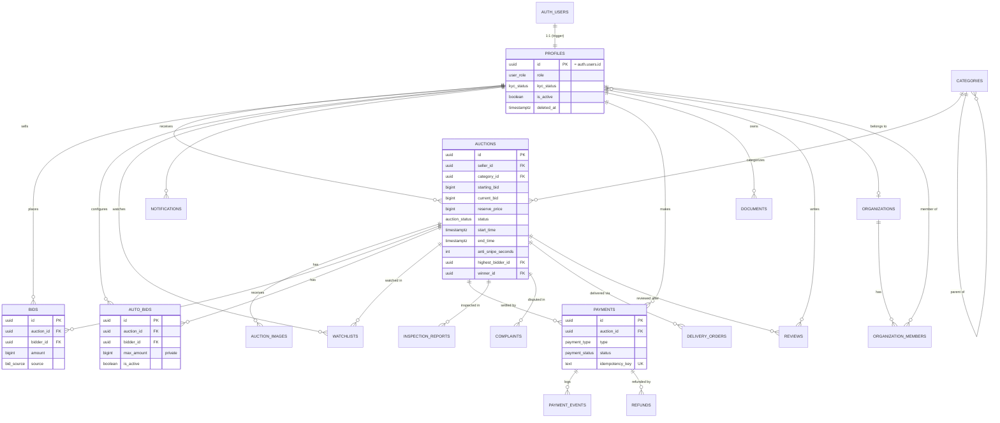

# Bid 4 Local — Entity Relationship Diagram

```mermaid
erDiagram
  AUTH_USERS ||--|| PROFILES : "1:1 (trigger)"
  PROFILES ||--o{ AUCTIONS : "sells"
  PROFILES ||--o{ BIDS : "places"
  PROFILES ||--o{ AUTO_BIDS : "configures"
  PROFILES ||--o{ WATCHLISTS : "watches"
  PROFILES ||--o{ NOTIFICATIONS : "receives"
  PROFILES ||--o{ PAYMENTS : "makes"
  PROFILES ||--o{ DOCUMENTS : "owns"
  PROFILES ||--o{ REVIEWS : "writes"
  PROFILES }o--o| ORGANIZATIONS : "belongs to"
  ORGANIZATIONS ||--o{ ORGANIZATION_MEMBERS : "has"
  PROFILES ||--o{ ORGANIZATION_MEMBERS : "member of"

  CATEGORIES ||--o{ AUCTIONS : "categorizes"
  CATEGORIES ||--o{ CATEGORIES : "parent of"

  AUCTIONS ||--o{ AUCTION_IMAGES : "has"
  AUCTIONS ||--o{ BIDS : "receives"
  AUCTIONS ||--o{ AUTO_BIDS : "has"
  AUCTIONS ||--o{ WATCHLISTS : "watched in"
  AUCTIONS ||--o{ PAYMENTS : "settled by"
  AUCTIONS ||--o{ INSPECTION_REPORTS : "inspected in"
  AUCTIONS ||--o{ COMPLAINTS : "disputed in"
  AUCTIONS ||--o{ DELIVERY_ORDERS : "delivered via"
  AUCTIONS ||--o{ REVIEWS : "reviewed after"

  PAYMENTS ||--o{ PAYMENT_EVENTS : "logs"
  PAYMENTS ||--o{ REFUNDS : "refunded by"

  PROFILES {
    uuid id PK "= auth.users.id"
    user_role role
    kyc_status kyc_status
    boolean is_active
    timestamptz deleted_at
  }
  AUCTIONS {
    uuid id PK
    uuid seller_id FK
    uuid category_id FK
    bigint starting_bid
    bigint current_bid
    bigint reserve_price
    auction_status status
    timestamptz start_time
    timestamptz end_time
    int anti_snipe_seconds
    uuid highest_bidder_id FK
    uuid winner_id FK
  }
  BIDS {
    uuid id PK
    uuid auction_id FK
    uuid bidder_id FK
    bigint amount
    bid_source source
  }
  AUTO_BIDS {
    uuid id PK
    uuid auction_id FK
    uuid bidder_id FK
    bigint max_amount "private"
    boolean is_active
  }
  PAYMENTS {
    uuid id PK
    uuid auction_id FK
    payment_type type
    payment_status status
    text idempotency_key UK
  }
```

Full column-level definitions are in [`DATABASE.md`](./DATABASE.md).
